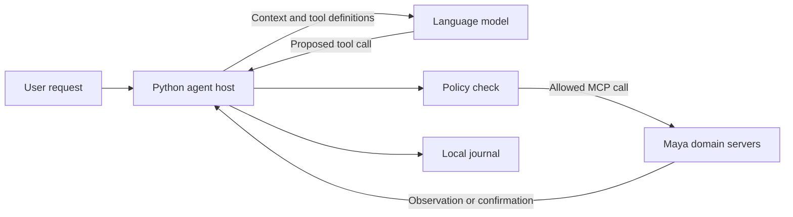

A useful agent must do more than describe a plan. It needs to discover real options, act within a budget, remember what it has already done, and recover when the world changes between a search and a booking.

[Maya](https://github.com/shvinn/maya) gives you somewhere to learn these behaviors. It simulates flights, hotels, car rentals, events, and food delivery in a fictional world. Your agent can search and book through MCP, while inventory, cancellation rules, and a shared clock make its decisions consequential inside the simulation.

This tutorial builds a small Python agent that reads across those services and can reserve a hotel through a guarded booking function. The goal is a foundation you can understand and extend, rather than a large framework that hides the agent loop.

> **Get the working starter:** [Download the Python example](/examples/maya-agent/maya-agent.zip), or [browse its source](https://github.com/shvinn/bapiraj.github.io/tree/main/public/examples/maya-agent). It includes the agent, dependencies, policy tests, a live MCP check, and setup notes. The starter uses MCP Python SDK 2.2.0.

## What you will build

The starter accepts a request such as:

> Find a refundable hotel for two people in Aira, for two nights starting 14 days from Maya time. Keep the hotel booking within 250 bucks.

It has three separate responsibilities:

| Component | Responsibility |
|---|---|
| Language model | Interpret the request and propose the next tool call |
| Python agent host | Route tools, enforce booking policy, record actions, and return observations |
| Maya | Maintain the world, compute prices and availability, and confirm or reject actions |

The model does not own the budget check. The host does not invent availability. Maya does not choose the user's itinerary.



**Deploying an agent for Maya means running your agent alongside Maya and connecting it over MCP.** Maya does not provide an agent-upload API or execute your agent code. You can run both processes on your laptop, connect to a Docker-hosted Maya server, or place them on a private server.

## Prerequisites

You need Python 3.10 or newer, Git, and [uv](https://docs.astral.sh/uv/getting-started/installation/). The model-driven example also needs an OpenAI API key and a model with function calling available to your account. Model API calls incur provider charges; Maya's bookings use fictional currency and do not charge real money.

You can run the connection check, policy tests, and live MCP integration check without a model API key. If MCP is new to you, read [What Is the Model Context Protocol?](/article/what-is-mcp) first.

Commands below use a macOS or Linux shell. On Windows, use the equivalent PowerShell commands and replace `.venv/bin/python` with `.venv\Scripts\python.exe`.

## Step 1: Start an isolated Maya world

Clone the latest Maya from `main` and install its locked dependencies:

```bash title="terminal 1"
git clone https://github.com/shvinn/maya.git
cd maya
uv sync --frozen
mkdir -p state
```

Start all domains, keeping the database in an explicit location:

```bash title="terminal 1"
MAYA_DB_PATH="$(pwd)/state/maya.db" \
  uv run maya serve --domain all --host 127.0.0.1 --port 6292
```

Keep this terminal running. The combined server exposes a separate endpoint per domain:

| Service | Endpoint |
|---|---|
| Flights | `http://127.0.0.1:6292/flights/mcp` |
| Hotels | `http://127.0.0.1:6292/hotels/mcp` |
| Cars | `http://127.0.0.1:6292/cars/mcp` |
| Events | `http://127.0.0.1:6292/events/mcp` |
| Delivery | `http://127.0.0.1:6292/delivery/mcp` |
| World controls | `http://127.0.0.1:6292/world/mcp` |

Maya's clock uses **Mayan Meridian Time (MYT), fixed UTC−08:00**, with no daylight saving. Its SQLite database preserves bookings and clock state across restarts. Restarting the process does not create an empty world.

Use a separate database for each experiment. Give the agent access to domain tools and the read-only `world_get_time` tool that appears on each domain server. Keep clock controls and reset tools in your test harness.

## Step 2: Install the starter and verify the connection

Extract the downloaded starter into a separate folder, open a second terminal there, and install its dependencies:

```bash title="terminal 2 — inside the extracted starter"
uv venv .venv
uv pip install --python .venv/bin/python -r requirements.txt
.venv/bin/python agent.py --smoke
```

The smoke command discovers the exposed read tools and prints Maya time. It makes no booking and needs no model credentials. If it cannot connect, check that terminal 1 is still running and that the port matches.

The key MCP lifecycle is small:

```python title="Connecting to one domain"
from mcp import ClientSession
from mcp.client.streamable_http import streamable_http_client

async with streamable_http_client(
    "http://127.0.0.1:6292/hotels/mcp"
) as (read, write, *_):
    async with ClientSession(read, write) as session:
        await session.initialize()
        tools = await session.list_tools()
        for tool in tools.tools:
            print(tool.name, tool.input_schema)
```

Initialize the session before listing or calling tools. Discover the contract rather than guessing a function's arguments. The [official MCP Python client documentation](https://py.sdk.modelcontextprotocol.io/client/) describes the client lifecycle and result types.

MCP transports and SDK names evolve. The starter pins SDK 2.2.0 and uses its snake-case fields, including `input_schema` and `is_error`; older examples may show `inputSchema` and `isError`. Keep server and client dependencies explicit when reproducing an example.

## Step 3: Give the model a limited tool surface

Maya exposes reset and booking tools as well as searches. Your host should decide which capabilities the agent receives.

The starter uses an explicit read-tool allowlist. It exposes searches and catalog lookups across all five domains, but omits every reset tool, clock mutation, and direct booking function.

A discovered MCP tool is translated into a model function definition:

```python title="agent.py — tool discovery"
if tool.name in READ_TOOLS:
    functions[tool.name] = {
        "type": "function",
        "name": tool.name,
        "description": tool.description or tool.name,
        "parameters": tool.input_schema,
        "strict": False,
    }
```

This fragment illustrates the mapping; the downloadable implementation stores the definitions in `MayaClient.tools` and their domain routes in `MayaClient.routes`.

The discovered schemas contain optional arguments with defaults. The starter preserves them and explicitly disables strict schema normalization for these read functions. Its custom `reserve_hotel` function uses a small strict schema instead.

The host checks the allowlist again at dispatch time. Hiding a tool from the model is useful, but a crafted or mistaken tool call must still be rejected by the executor.

## Step 4: Add the model-driven agent loop

Set credentials in your environment, not in the source files:

```bash title="terminal 2"
export OPENAI_API_KEY="your-api-key"
export OPENAI_MODEL="your-function-calling-model"
```

Replace the model placeholder with one available to your account. The starter reads this value rather than assuming everyone has access to the same model.

Run a read-only request first:

```bash
.venv/bin/python agent.py --task \
  "Read Maya time and find a refundable two-night hotel stay in Aira, starting 14 days from now. Do not book."
```

The host sends the task and tool definitions to the model. It executes each returned function call, sends the result back, and repeats until the model produces an answer or reaches the turn limit. [OpenAI's function-calling documentation](https://developers.openai.com/api/docs/guides/function-calling) explains this request/result exchange.

The important part of the implementation is:

```python title="agent.py — inside the bounded loop"
response = await client.responses.create(
    model=model,
    instructions=INSTRUCTIONS,
    input=history,
    tools=host.functions(),
    parallel_tool_calls=False,
    store=False,
)

history.extend(response.output)
requests = [item for item in response.output
            if item.type == "function_call"]

for request in requests:
    arguments = json.loads(request.arguments)
    result = await host.dispatch(request.name, arguments)
    history.append({
        "type": "function_call_output",
        "call_id": request.call_id,
        "output": json.dumps(result),
    })
```

Preserve the full response output, including reasoning items, when carrying conversation state forward. The complete starter also handles invalid JSON, closes the model client, and stops after 20 model turns. Sequential tool execution makes the first version easier to reason about.

The model API runs remotely, but **your Python host makes the localhost MCP connection**. You are not asking a hosted model service to reach `127.0.0.1` on your computer.

## Step 5: Enforce booking policy in Python

A prompt can ask the model to respect a budget. It cannot guarantee that every booking request will respect it. Put the rule at the boundary where a proposal becomes a write.

The starter's model-facing write capability is `reserve_hotel`, not Maya's unrestricted `hotels_book_room`. It accepts a room identifier and dates. The host supplies the guest name, party size, and contact identity from command-line authorization.

Before booking, the host checks:

- Booking mode was explicitly enabled.
- The requested room still appears in a fresh availability search.
- The room is refundable, with check-in at least two calendar days ahead.
- The stay is 1–14 nights and within Maya's booking horizon.
- Existing confirmed hotel bookings plus this quote fit the hotel budget.

The budget check happens before the write:

```python title="agent.py — hotel budget gate"
spent = sum(
    op["result"]["total_price"]["amount"]
    for op in journal["operations"].values()
    if op["state"] == "CONFIRMED"
)

if spent + quote["total_price"]["amount"] > budget:
    return {"error": {
        "code": "budget_exceeded",
        "message": "Quoted total exceeds the remaining hotel budget.",
    }}
```

Search and booking are separate calls, so another buyer can still change availability or price. The host checks the confirmation total too. If it exceeds the budget, it attempts to cancel the refundable booking and records the result. This is compensation after a price change, not an atomic price guarantee.

Enable booking for a specific hotel experiment:

```bash title="terminal 2"
.venv/bin/python agent.py \
  --allow-bookings --budget 250 --guests 2 \
  --guest-name "Alex Learner" \
  --contact-email "maya-learner@example.invalid" \
  --journal hotel-reservation.json \
  --task "Book the cheapest refundable hotel for two people in Aira, for two nights starting 14 days from Maya time, within the hotel budget. If none fits, do not book."
```

The 250-buck allowance covers **hotel bookings only**, not a whole holiday. Flights, cars, food, and events remain read-only in this starter. An agent should say that clearly rather than present unbooked parts of a plan as confirmed.

Maya hotels are all in Aira. A hotel booking is one room, and its `guests` count cannot exceed that room type's capacity. A larger group may need several rooms and explicit aggregate budgeting.

## Step 6: Interpret the response correctly

An MCP call can succeed at the protocol level while the requested action fails in the simulation.

For example, a hotel may return:

```json title="A business-rule failure"
{
  "error": {
    "code": "sold_out",
    "message": "The requested room is no longer available.",
    "hint": "Search again for another room type or hotel."
  }
}
```

This is an illustrative envelope; the exact message names the hotel, room, and night. Inspect `error.code` in the returned payload as well as the SDK's `is_error` flag. Returning the observation to the model lets it search for an alternative instead of announcing a fictional success.

Also decode all text content blocks. With the tested SDK, some list responses appear as one JSON object per block; reading `content[0]` alone silently discards the rest:

```python title="agent.py — result decoding"
values = [json.loads(block.text)
          for block in result.content if block.type == "text"]
value = values[0] if len(values) == 1 else values
```

The downloadable implementation additionally tolerates plain-text replies. Read a booking back by its actual reference when reporting confirmation. Different domains use different identifiers:

| Domain | Confirmation field |
|---|---|
| Flights, hotels, events | `booking_reference` |
| Cars | `rental_reference` |
| Delivery | `order_id` |

Match options by stable identifiers, not array position. Price-sorted flight results can reorder after a booking changes their fares.

## Step 7: Remember writes before retrying them

A lost response creates an awkward question: did the server reject the booking, or did it confirm the booking before the connection failed?

Blindly repeating a write can reserve a second room. The starter uses a local journal with this lifecycle:

```text
Intent recorded as PENDING
    → booking request sent
    → confirmation recorded as CONFIRMED
```

It records intent **before** calling Maya. An exact request already marked `CONFIRMED` returns its stored receipt instead of issuing another booking.

If a later run finds a `PENDING` reservation, it lists Maya bookings for the experiment's contact email and matches the room, dates, guest name, and party size. One match recovers the confirmation. Zero or multiple matches stop execution for inspection; the starter does not automatically retry an uncertain write.

Keep the same journal when retrying the same experiment, and use a distinct dummy contact for a new experiment. The journal is bound to the Maya URL, identity, party, and budget. Do not delete a pending journal just to make an error disappear.

This is duplicate prevention for a single writer, not universal exactly-once execution. Multiple agent processes, external cancellations, and database resets need additional coordination and reconciliation.

## Step 8: Test behavior before adding more autonomy

Start with key-free policy tests:

```bash
.venv/bin/python -m unittest -v test_agent.py
```

Then run the live integration check against your disposable Maya world:

```bash
.venv/bin/python smoke_test.py
```

It uses a unique dummy contact, verifies that a too-small budget creates no booking, makes a refundable booking, checks duplicate prevention and pending-response recovery, and cancels that booking afterward. It does not reset other users' inventory.

For more demanding agents, make a small scenario suite:

| Scenario | Evidence to check |
|---|---|
| Room sells out after search | Agent chooses another room or reports infeasibility |
| Budget cannot cover the requested stay | No booking is created |
| Response is lost after confirmation | Resume finds one booking, not two |
| Event has an age limit | Agent filters by the youngest attendee |
| User changes an event | Retained fees appear in the revised budget |
| Dinner must arrive before a show | Agent accounts for prep, delivery, eating, and travel time |

Maya's clock controls help you test deadlines without waiting hours. Use a separate harness to freeze or advance time. Do not give those controls to the agent being tested: skipping past a deadline would change the task rather than solve it.

**Verification scope:** the starter's policy tests and live MCP checks were run against Maya revision `c85e0ee13bd55fcec2551a011590669db2cd4190`. This records the version tested; the setup above uses the latest `main`. The Responses loop was checked with a mocked model response sequence. A paid live-model run was not performed while preparing this article; you need your own credentials and model access for that part.

## Step 9: Run the agent alongside Maya

### Local processes

The two-terminal setup is already a deployment: Maya owns the simulation state; your Python process owns the agent loop and journal. Override the address when needed:

```bash
.venv/bin/python agent.py \
  --maya-url http://127.0.0.1:6292 \
  --journal ./state/hotel-agent.json \
  --task "Find a refundable hotel in Aira. Do not book."
```

This CLI runs once and exits. It does not schedule a later meal or keep monitoring a booking. To build a long-running concierge, add a worker that resumes saved tasks, reads Maya time, and executes due actions. Persist both the worker's journal and Maya's database.

### Docker-hosted Maya

The project's documented image exposes all domain endpoints:

```bash
# Documented deployment option; Docker was not exercised for this tutorial.
docker run --rm \
  -p 127.0.0.1:6292:6292 \
  -v maya-data:/data \
  ghcr.io/shvinn/maya
```

Run the Python agent on the host and keep the same localhost URL. If you later containerize the agent too, `localhost` inside its container refers to that container, not Maya. Put both containers on the same private network and use Maya's service name as the hostname. Account for Maya's allowed-host/DNS-rebinding configuration; the repository's Docker smoke script tests its expected container hostname.

The image command follows the project's deployment documentation. The published image and the latest source checkout may have different release dates.

### A private server

Run Maya and the agent as separate supervised processes, or as services on a private container network. Keep credentials in the agent process, mount persistent storage, and restart interrupted jobs through reconciliation.

Maya has no application authentication. Keep its endpoint on loopback or a private network; put an authenticated gateway in front of it if remote access is necessary. A shared database is a shared world, so one agent's bookings affect the next agent's searches.

## Extend the starter into your own agent

Once the hotel workflow is reliable, choose one additional capability and add its policy gate.

For a round-trip planner, validate both legs and reserve budget for the trip home before booking the outbound flight. Puffin Air is non-refundable; other airlines have a 24-hour cancellation window. A one-stop itinerary has multiple legs, and an overnight connection may require lodging that the ticket does not include.

For events, check the youngest attendee's age, per-order ticket limits, and section availability. Include the service fee in the purchase price; refundable shows return face value and retain the fee.

For delivery, derive the destination from the hotel's zone rather than inventing a street address. Order when the guest is checked in. ETA includes vendor preparation and courier travel time; once preparation ends, cancellation is no longer available.

For a complete concierge, use a typed brief containing dates, travelers, budget, dietary requirements, and flexibility preferences. Let the model interpret the request and explain tradeoffs, while deterministic code checks time conflicts and spending. Record each commitment, verify it, and cancel reversible commitments if a later required booking fails. Maya offers no atomic transaction spanning all domains, so partial success must remain visible.

A useful next exercise is to give your agent the same request twice: first in an empty world, then after another client buys its chosen room. Inspect the receipts and ask whether the agent still met the original requirements. That is where a tool-using assistant starts becoming a dependable agent.
