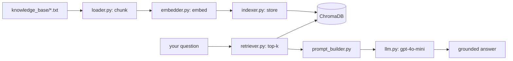

Retrieval-Augmented Generation grounds a language model in **your** data: instead
of relying on what the model memorized, you retrieve relevant context at query
time and make the model answer only from it. This eliminates most hallucinations
and lets the model answer questions about private or fictional data it never saw
in training.

In this tutorial you'll build a complete RAG pipeline that answers questions
about a fictional exoplanet, **Velorath**, from a small knowledge base — then
evaluate it with faithfulness and relevancy metrics.

> **Follow along:** the full project is at
> [github.com/shvinn/exoplanet-rag](https://github.com/shvinn/exoplanet-rag).
> Every file below is a real file in that repo. Clone it, or hand the link to a
> coding agent and ask it to reproduce these steps.

## What you'll build



| Component | Technology |
|---|---|
| Chunking | Plain Python |
| Embeddings | `sentence-transformers` — `all-MiniLM-L6-v2` |
| Vector store | ChromaDB (in Docker) |
| LLM | OpenAI `gpt-4o-mini` |
| Tooling | `uv` |

## Step 0 — Prerequisites

- Python 3.13+ and [`uv`](https://github.com/astral-sh/uv)
- Docker (for ChromaDB)
- An OpenAI API key

```toml title="pyproject.toml"
[project]
name = "exoplanet-rag"
requires-python = ">=3.13"
dependencies = [
    "chromadb>=1.5.7",
    "openai>=2.31.0",
    "python-dotenv>=1.2.2",
    "sentence-transformers>=5.4.0",
]
```

```bash
uv sync                       # install dependencies
echo "OPENAI_API_KEY=sk-..." > .env
```

## Step 1 — Start the vector store

ChromaDB runs as a service so your index persists between runs.

```yaml title="docker-compose.yml"
services:
  chromadb:
    image: chromadb/chroma
    ports:
      - "8000:8000"
    volumes:
      - ./chroma_db:/data
```

```bash
docker compose up -d
```

## Step 2 — Load and chunk documents

Embedding models have a limited context window and retrieval is sharper on
smaller passages, so we split each document into overlapping character windows.
The overlap keeps sentences that straddle a boundary from being lost.

```python title="loader.py"
import os


def load_documents(directory):
    documents = []
    for filename in os.listdir(directory):
        if filename.endswith(".txt"):
            with open(os.path.join(directory, filename)) as f:
                documents.append({"filename": filename, "text": f.read()})
    return documents


def chunk_document(doc, chunk_size, chunk_overlap):
    if chunk_overlap >= chunk_size:
        raise ValueError("chunk_overlap must be less than chunk_size")

    text, filename = doc["text"], doc["filename"]
    chunks, start, i = [], 0, 0
    while start < len(text):
        end = start + chunk_size
        chunks.append({
            "chunk_id": f"{filename}_chunk_{i}",
            "filename": filename,
            "text": text[start:end],
        })
        i += 1
        start = end - chunk_overlap        # step back to create overlap
    return chunks


def load_and_chunk(directory, chunk_size, chunk_overlap):
    all_chunks = []
    for doc in load_documents(directory):
        chunks = chunk_document(doc, chunk_size, chunk_overlap)
        all_chunks.extend(chunks)
        print(f"{doc['filename']} → {len(chunks)} chunks")
    return all_chunks
```

## Step 3 — Turn chunks into vectors

`all-MiniLM-L6-v2` is small, fast, and runs locally — no API calls for
embeddings. Each chunk becomes a 384-dimensional vector where semantic
similarity is geometric proximity:

$$
\text{sim}(\mathbf{a}, \mathbf{b}) = \frac{\mathbf{a}\cdot\mathbf{b}}{\lVert\mathbf{a}\rVert\,\lVert\mathbf{b}\rVert}
$$

```python title="embedder.py"
from sentence_transformers import SentenceTransformer


def load_model(model_name):
    return SentenceTransformer(model_name)


def generate_embeddings(chunks, model):
    texts = [chunk["text"] for chunk in chunks]
    return model.encode(texts, show_progress_bar=True)
```

## Step 4 — Index into ChromaDB

ChromaDB stores the vectors alongside the original text and metadata, and handles
nearest-neighbor search for us.

```python title="indexer.py"
import chromadb


def get_collection(host, port, collection_name):
    client = chromadb.HttpClient(host=host, port=port)
    return client.get_or_create_collection(collection_name)


def index_chunks(chunks, embeddings, collection):
    collection.add(
        ids=[c["chunk_id"] for c in chunks],
        documents=[c["text"] for c in chunks],
        metadatas=[{"filename": c["filename"]} for c in chunks],
        embeddings=embeddings.tolist(),
    )
    print(f"Indexed {collection.count()} chunks")
```

The one-time indexing entry point wires Steps 2–4 together:

```python title="index.py"
from dotenv import load_dotenv
from loader import load_and_chunk
from embedder import load_model, generate_embeddings
from indexer import get_collection, index_chunks

load_dotenv()
CHUNK_SIZE, CHUNK_OVERLAP = 500, 50
EMBEDDING_MODEL = "all-MiniLM-L6-v2"


def main():
    collection = get_collection("localhost", 8000, "velorath")
    if collection.count() > 0:
        print("Already indexed, skipping.")
        return
    chunks = load_and_chunk("knowledge_base", CHUNK_SIZE, CHUNK_OVERLAP)
    model = load_model(EMBEDDING_MODEL)
    embeddings = generate_embeddings(chunks, model)
    index_chunks(chunks, embeddings, collection)


if __name__ == "__main__":
    main()
```

```bash
uv run index.py        # run once
```

## Step 5 — Retrieve relevant context

At query time we embed the **question** with the same model and ask ChromaDB for
the closest chunks.

```python title="retriever.py"
def retrieve(question, collection, model, top_k=3):
    question_embedding = model.encode([question]).tolist()
    results = collection.query(query_embeddings=question_embedding, n_results=top_k)

    return [
        {"text": text, "filename": meta["filename"], "distance": dist}
        for text, meta, dist in zip(
            results["documents"][0],
            results["metadatas"][0],
            results["distances"][0],
        )
    ]
```

## Step 6 — Build a grounded prompt

The system prompt is the guardrail: answer **only** from the supplied context.
This single instruction is the most effective lever against hallucination.

```python title="prompt_builder.py"
SYSTEM_PROMPT = (
    "You are an expert on the exoplanet Velorath. Answer the user's question "
    "using only the context provided. If the answer is not in the context, say "
    "you don't have enough information."
)


def build_prompt(question, chunks):
    context = "\n\n".join(
        f"[Source: {c['filename']}]\n{c['text'].strip()}" for c in chunks
    )
    return f"Context:\n{context}\n\nQuestion: {question}"
```

## Step 7 — Generate the answer

```python title="llm.py"
from openai import OpenAI


def get_client(api_key):
    return OpenAI(api_key=api_key)


def generate_answer(client, system_prompt, user_message, history, model="gpt-4o-mini"):
    messages = [{"role": "system", "content": system_prompt}, *history,
                {"role": "user", "content": user_message}]
    response = client.chat.completions.create(model=model, messages=messages)
    return response.choices[0].message.content
```

## Step 8 — Put it together in a CLI

```python title="query.py"
import os
from dotenv import load_dotenv
from embedder import load_model
from indexer import get_collection
from retriever import retrieve
from prompt_builder import build_prompt, SYSTEM_PROMPT
from llm import get_client, generate_answer

load_dotenv()
TOP_K = 2


def main():
    model = load_model("all-MiniLM-L6-v2")
    collection = get_collection("localhost", 8000, "velorath")
    client = get_client(os.getenv("OPENAI_API_KEY"))
    history = []

    while (question := input("You: ").strip()) != "exit":
        if not question:
            continue
        chunks = retrieve(question, collection, model, top_k=TOP_K)
        user_message = build_prompt(question, chunks)
        answer = generate_answer(client, SYSTEM_PROMPT, user_message, history)
        history += [{"role": "user", "content": user_message},
                    {"role": "assistant", "content": answer}]
        print(f"Velorath: {answer}\n")


if __name__ == "__main__":
    main()
```

```bash
uv run query.py
```

## Step 9 — Evaluate quality

"It looks good" is not a metric. The repo scores the pipeline against 18 hand-written
Q&A pairs using four RAGAS-style metrics:

| Metric | Measures | Method |
|---|---|---|
| Faithfulness | Are all answer claims supported by context? | LLM-as-judge |
| Answer Relevancy | Does the answer address the question? | Embedding similarity |
| Context Recall | Did retrieval surface enough to answer? | LLM-as-judge |
| Context Precision | How many retrieved chunks were useful? | LLM-as-judge |

```bash
uv run eval/evaluate.py
```

Baseline at `top_k=2`: **Faithfulness 0.917**, Answer Relevancy 0.728,
Context Recall 0.903, Context Precision 0.639.

> Notice precision is the weak spot — at `top_k=2` some retrieved chunks aren't
> useful. **Most "RAG quality" problems are retrieval problems.** Tune
> `chunk_size`, `chunk_overlap`, and `top_k`, re-run the eval, and watch these
> numbers move before you ever reach for a bigger model.

## Where to take it next

- Swap character chunking for sentence/semantic splitting.
- Add a re-ranker between retrieval and the prompt to lift precision.
- Replace the local embedder with a hosted one and compare eval scores.

The full, runnable project — including the knowledge base and evaluation
harness — is at [github.com/shvinn/exoplanet-rag](https://github.com/shvinn/exoplanet-rag).
