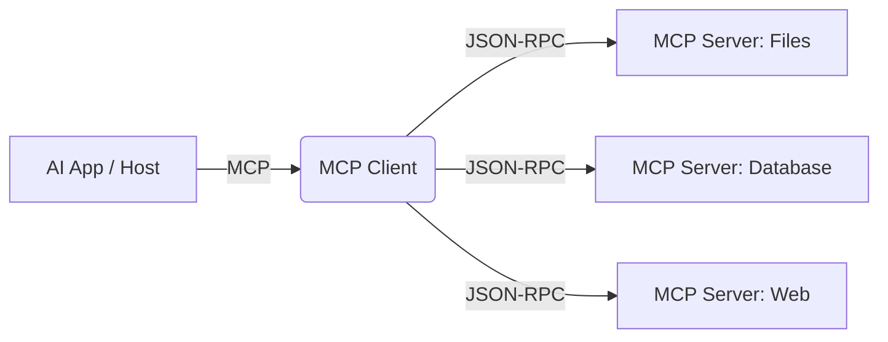

The **Model Context Protocol (MCP)** is an open standard for connecting AI
applications to the systems where data and capabilities live. Before MCP, every
integration between a model and a tool was bespoke. MCP replaces that N×M
explosion with a single, well-specified interface.

## Why a protocol at all?

Think of how messy device connectivity was before USB. Each peripheral shipped
its own port and driver. USB collapsed that into one contract. MCP does the same
for AI: a model speaks MCP, a tool speaks MCP, and they interoperate.



## The three primitives

MCP servers expose capabilities through three primitives:

- **Tools** — functions the model can call (with typed inputs/outputs).
- **Resources** — readable data the model can pull into context.
- **Prompts** — reusable, parameterized prompt templates.

```python title="A minimal tool definition (FastMCP)"
from mcp.server.fastmcp import FastMCP

mcp = FastMCP("weather")


@mcp.tool()
def get_weather(city: str) -> dict:
    """Get the current weather for a city."""
    return fetch_weather(city)
```

The type hint becomes the tool's input schema and the docstring becomes the
description the model reads — that's the entire contract.

## Where it fits in an agent

An agent loop calls the model, the model requests a tool, the host routes that
request over MCP to the right server, and the result flows back into context.
Because the transport is standardized, you can add a new capability without
touching the agent's core logic.

> The win isn't any single tool — it's that the *marginal cost* of adding the
> next tool drops to near zero.

In the [next article](/article/build-an-mcp-server) we build a working MCP
server from scratch.
